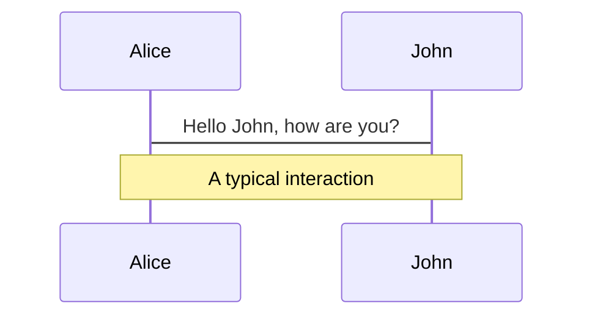
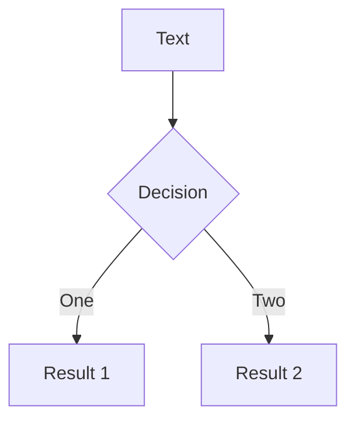

---
# try also 'default' to start simple
theme: seriph
# random image from a curated Unsplash collection by Anthony
# like them? see https://unsplash.com/collections/94734566/slidev
background: /images/1-background.jpg
# apply any windi css classes to the current slide
class: 'text-center'
# https://sli.dev/custom/highlighters.html
highlighter: shiki
# show line numbers in code blocks
lineNumbers: false
# some information about the slides, markdown enabled
info: |
  ## Slidev Starter Template
  Presentation slides for developers.

  Learn more at [Sli.dev](https://sli.dev)
---

# Khóa học luyện thi chứng chỉ AWS

Dành cho Kiến trúc sư giải pháp và nhà phát triển trong 3 tuần

<div class="abs-br m-6 flex gap-2">
  Đà Nẵng, năm COVID thứ 2
</div>


<!--
The last comment block of each slide will be treated as slide notes. It will be visible and editable in Presenter Mode along with the slide. [Read more in the docs](https://sli.dev/guide/syntax.html#notes)
-->

---

# IAM 1

AWS Identity and Access Management (IAM)

- **IAM Resources** - user, group, role, policy, identity provider
- **Root User** - When you first create an AWS account, you begin with a single sign-in identity that has complete access to all AWS services and resources in the account.
- **IAM Users** - A user that represents an application is called a Service Account.
- **IAM Credentials** - Can be used in API calls, CLI and PowerShell.
- **IAM Groups**
    - You can add a user to a maximum of 10 groups.
  - Groups cannot be nested.
  - A group cannot be identified as a Principal in a resource-based policy. 
- **IAM Permissions** - Permissions decision tree:
	- Firstly looks for explicit denies,
	- Secondly looks for explicit allows,
	- Lastly denies any action that is not explicitly allowed.
- **EC2 Instance Profile** - An IAM role that you can attach to an EC2 instance.

---

# IAM 2

- **IAM Roles** 
  - An IAM identity that you can create in your account that has specific permissions. 
  - Has some similarities to an IAM user. Roles and users are both AWS identities with permissions policies that determine what the identity can and cannot do in AWS. 
  - However, instead of being uniquely associated with one person, a role is intended to be assumable by anyone who needs it.
  - When you assume a role, the AWS Security Token Service (STS) provides you with temporary security credentials for your role session. 
  - Assuming a role = getting temporary keys to perform the actions allowed for that role.
  - While a user is assuming a role, he looses access to his original user permissions.
- **AWS Service Roles** - A service role: A role that a service assumes to perform actions in your account on your behalf. 
- **AWS Service-Linked Role** - Service-linked roles are predefined by the linked service and include all the permissions that the linked service requires to call other AWS services on your behalf.

---

# IAM 3

- **IAM Policies** - AWS supports six types of policies: identity-based policies, resource-based policies, permissions boundaries, Organizations SCPs, ACLs, and session policies.
- **Inline Policies** - Main use case for inline polices: you want to be sure that the permissions in a policy are not inadvertently assigned to an identity other than the one they're intended for.
- **Managed Policies**
  - Customer-Managed Policies
  - AWS-Managed Policies
  - Job Functions
- **Permission Boundaries** - A permissions boundary is an advanced feature used to set the maximum permissions that an identity-based policy can grant to an IAM entity.
- **Cross-Account Access**
  - Using roles for Cross-account access
  - Using Resource-based policies for Cross-account access

---

# IAM 4

- **IAM Identity Federation** - Federated users are users (or applications) who do not have AWS accounts. 
  - IAM supports IdPs that are compatible with OpenID Connect (OIDC) or SAML 2.0.

- **AWS Single Sign-On (AWS SSO)** - A cloud-based single sign-on (SSO) service focused on SSO for employees when accessing AWS services or cloud apps.

- **AWS Directory Service**
  - **AWS Directory Service for Microsoft Active Directory** - Also known as AWS Managed Microsoft AD.
  - **AD Connector** - A proxy service to establish a trusted relationship between your Active Directory and AWS. 
  - **Simple AD** - Supports basic Active Directory features such as user accounts, group memberships, joining a Linux domain or Windows based EC2 instances, Kerberos-based SSO, and group policies.
  - **Amazon Cognito** - This fully managed service scales to support hundreds of millions of users. 


---

# IAM 5

- **Cognito User Pools** - With Cognito user pool, your users can sign up and sign in to your web or mobile app.
- **Amazon Cognito identity pools (federated identities)** - Enables identity federation to allow access to AWS services (authorization) for federated users.
  - Supported IdPs:
    - Public providers: Amazon, Facebook, Google, Apple.
    - Amazon Cognito User Pools.
    - OIDC IdPs
    - SAML IdPs

  - Auth Flow:
    - Your app authenticates to the IdP and gets a token from this IdP.
    - Your app calls GetId to Cognito Identity Pools which returns an identity.
    - Your app calls GetCredentialsForIdentity to Cognito Identity Pools which calls AWS STS on behalf of the user and returns the STS token to your app.

---

# IAM 6

- **Amazon Cloud Directory**
  - A highly available multi-tenant directory-based store in AWS. 
  - Can scale automatically to hundreds of millions of objects as needed for applications. 
  - You can organize directory objects into multiple hierarchies to support many organizational pivots and relationships across directory information.
  - Examples:
    - A directory of users may provide a hierarchical view based on reporting structure, location, and project affiliation. 
    - A directory of devices may have multiple hierarchical views based on its manufacturer, current owner, and physical location. 

---


# Navigation

Hover on the bottom-left corner to see the navigation's controls panel, [learn more](https://sli.dev/guide/navigation.html)

### Keyboard Shortcuts

|     |     |
| --- | --- |
| <kbd>right</kbd> / <kbd>space</kbd>| next animation or slide |
| <kbd>left</kbd>  / <kbd>shift</kbd><kbd>space</kbd> | previous animation or slide |
| <kbd>up</kbd> | previous slide |
| <kbd>down</kbd> | next slide |

<!-- https://sli.dev/guide/animations.html#click-animations -->

<p v-after class="absolute bottom-23 left-45 opacity-30 transform -rotate-10">Here!</p>

---
layout: image-right
image: https://source.unsplash.com/collection/94734566/1920x1080
---

# Code

Use code snippets and get the highlighting directly![^1]

```ts {all|2|1-6|9|all}
interface User {
  id: number
  firstName: string
  lastName: string
  role: string
}

function updateUser(id: number, update: User) {
  const user = getUser(id)
  const newUser = {...user, ...update}  
  saveUser(id, newUser)
}
```

<arrow v-click="3" x1="400" y1="420" x2="230" y2="330" color="#564" width="3" arrowSize="1" />

[^1]: [Learn More](https://sli.dev/guide/syntax.html#line-highlighting)

<style>
.footnotes-sep {
  @apply mt-20 opacity-10;
}
.footnotes {
  @apply text-sm opacity-75;
}
.footnote-backref {
  display: none;
}
</style>

---

# Components

<div grid="~ cols-2 gap-4">
<div>

You can use Vue components directly inside your slides.

We have provided a few built-in components like `<Tweet/>` and `<Youtube/>` that you can use directly. And adding your custom components is also super easy.

```html
<Counter :count="10" />
```

<!-- ./components/Counter.vue -->
<Counter :count="10" m="t-4" />

Check out [the guides](https://sli.dev/builtin/components.html) for more.

</div>
<div>

```html
<Tweet id="1390115482657726468" />
```

<Tweet id="1390115482657726468" scale="0.65" />

</div>
</div>


---
class: px-20
---

# Themes

Slidev comes with powerful theming support. Themes can provide styles, layouts, components, or even configurations for tools. Switching between themes by just **one edit** in your frontmatter:

<div grid="~ cols-2 gap-2" m="-t-2">

```yaml
---
theme: default
---
```

```yaml
---
theme: seriph
---
```


</div>

Read more about [How to use a theme](https://sli.dev/themes/use.html) and
check out the [Awesome Themes Gallery](https://sli.dev/themes/gallery.html).

---
preload: false
---

# Animations

Animations are powered by [@vueuse/motion](https://motion.vueuse.org/).

```html
<div
  v-motion
  :initial="{ x: -80 }"
  :enter="{ x: 0 }">
  Slidev
</div>
```

<div class="w-60 relative mt-6">
  <div class="relative w-40 h-40">
    
    
    
  </div>

  <div 
    class="text-5xl absolute top-14 left-40 text-[#2B90B6] -z-1"
    v-motion
    :initial="{ x: -80, opacity: 0}"
    :enter="{ x: 0, opacity: 1, transition: { delay: 2000, duration: 1000 } }">
    Slidev
  </div>
</div>

<!-- vue script setup scripts can be directly used in markdown, and will only affects current page -->
<script setup lang="ts">
const final = {
  x: 0,
  y: 0,
  rotate: 0,
  scale: 1,
  transition: {
    type: 'spring',
    damping: 10,
    stiffness: 20,
    mass: 2
  }
}
</script>

<div
  v-motion
  :initial="{ x:35, y: 40, opacity: 0}"
  :enter="{ y: 0, opacity: 1, transition: { delay: 3500 } }">

[Learn More](https://sli.dev/guide/animations.html#motion)

</div>

---

# LaTeX

LaTeX is supported out-of-box powered by [KaTeX](https://katex.org/).

<br>

Inline $\sqrt{3x-1}+(1+x)^2$

Block
$$
\begin{array}{c}

\nabla \times \vec{\mathbf{B}} -\, \frac1c\, \frac{\partial\vec{\mathbf{E}}}{\partial t} &
= \frac{4\pi}{c}\vec{\mathbf{j}}    \nabla \cdot \vec{\mathbf{E}} & = 4 \pi \rho \\

\nabla \times \vec{\mathbf{E}}\, +\, \frac1c\, \frac{\partial\vec{\mathbf{B}}}{\partial t} & = \vec{\mathbf{0}} \\

\nabla \cdot \vec{\mathbf{B}} & = 0

\end{array}
$$

<br>

[Learn more](https://sli.dev/guide/syntax#latex)

---

# Diagrams

You can create diagrams / graphs from textual descriptions, directly in your Markdown.

<div class="grid grid-cols-2 gap-10 pt-4 -mb-6">





</div>

[Learn More](https://sli.dev/guide/syntax.html#diagrams)


---
layout: center
class: text-center
---

# Learn More

[Documentations](https://sli.dev) · [GitHub](https://github.com/slidevjs/slidev) · [Showcases](https://sli.dev/showcases.html)
